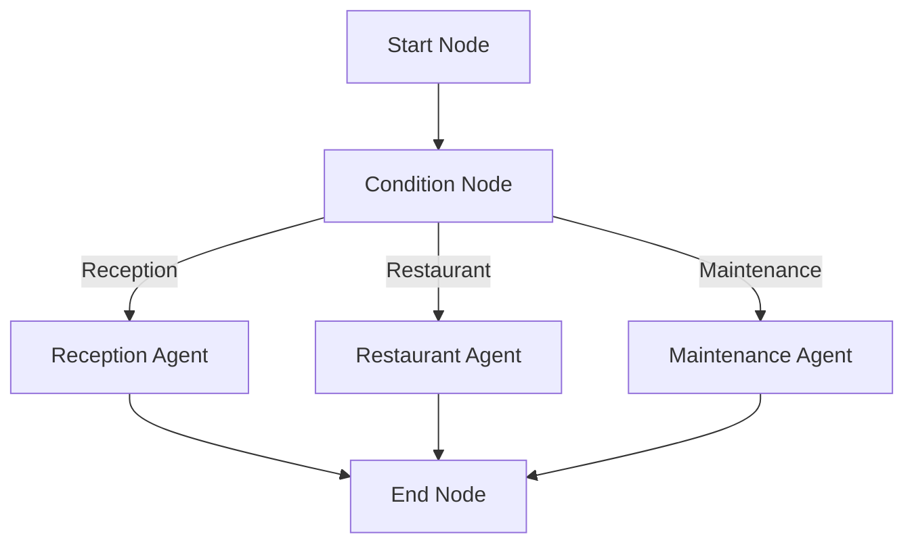

# 📄 FlowStep7.md — Comprehensive Breakdown (Multi-Agent System)

---

# 🌍 System Goal

Create a **multi-agent conversational AI system** with LangGraph and Node.js that:
- Routes user queries intelligently.
- Uses different specialized agents.
- Remembers conversation history.
- Returns tailored responses.

Agents:
- Reception Agent
- Restaurant Agent
- Maintenance Agent
- **Condition Agent** (Decision maker)

---

# 🔹 Step-by-Step Build Breakdown (From Step 2)

---

# ✅ Step 2: Build `conditionNode.js` (Routing Logic)

## Purpose:
- Analyze the **user’s latest message**.
- Decide **which agent** should handle the query.

## Logic:
- ⬇️ Keywords like "table", "food", "menu" ➡️ route to `restaurantAgent`
- ⬇️ Keywords like "broken", "repair", "maintenance" ➡️ route to `maintenanceAgent`
- ⬇️ Otherwise, default to `receptionAgent`

```javascript
const createConditionNode = () => {
  const conditionNode = async (state) => {
    const userMessage = (state.lastUserMessage || '').toLowerCase();
    let targetAgent = 'reception';

    if (userMessage.includes('food') || userMessage.includes('table') || userMessage.includes('menu')) {
      targetAgent = 'restaurant';
    } else if (userMessage.includes('broken') || userMessage.includes('repair') || userMessage.includes('maintenance')) {
      targetAgent = 'maintenance';
    }

    return { ...state, targetAgent };
  };
  return conditionNode;
};

module.exports = { createConditionNode };
```

---

# ✅ Step 3: Build Specialized Agent Nodes

## ⚡ Step 3.1: `receptionAgentNode.js`

**Purpose:**
- Handle check-ins, check-outs, general queries.
- Be polite and helpful.

## ⚡ Step 3.2: `restaurantAgentNode.js`

**Purpose:**
- Handle food-related queries.
- Book tables, answer menu-related questions.

## ⚡ Step 3.3: `maintenanceAgentNode.js`

**Purpose:**
- Handle room repairs, broken amenities, technical problems.

_All specialized nodes load memory, use a domain-specific system prompt, and respond naturally._

---

# ✅ Step 4: Build `endNode.js` (Finalize Session)

## Purpose:
- Log and end the session.
- Print conversation history.

```javascript
const createEndNode = () => {
  const endNode = async (state) => {
    console.log(`✅ Session ${state.sessionId} has ended.`);
    state.messages.forEach((msg, index) => {
      console.log(`${index + 1}. [${msg.from}] ${msg.content}`);
    });
    return state;
  };
  return endNode;
};

module.exports = { createEndNode };
```

---

# ✅ Step 5: Build `flow.js` (Assemble Graph)

## Purpose:
- Connect all nodes.
- Handle conditional routing via `targetAgent`.

## Flow Diagram:



## Code Overview:

```javascript
const graph = new Graph()
  .addNode('start', startNode)
  .addNode('condition', conditionNode)
  .addNode('receptionAgent', receptionAgentNode)
  .addNode('restaurantAgent', restaurantAgentNode)
  .addNode('maintenanceAgent', maintenanceAgentNode)
  .addNode('end', endNode)
  .addEdge('start', 'condition')
  .addConditionalEdge('condition', {
    reception: 'receptionAgent',
    restaurant: 'restaurantAgent',
    maintenance: 'maintenanceAgent'
  })
  .addEdge('receptionAgent', 'end')
  .addEdge('restaurantAgent', 'end')
  .addEdge('maintenanceAgent', 'end');
```

---

# ✅ Step 6: Update `agentService.js` (Run Graph)

## Purpose:
- Build LangGraph.
- Inject `sessionId` and `lastUserMessage`.
- Execute graph starting at `start` node.
- Return agent’s final answer.

```javascript
exports.processMessage = async (sessionId, message) => {
  const { graph, initialState } = await buildLangGraph();
  initialState.sessionId = sessionId;
  initialState.lastUserMessage = message;
  const finalState = await graph.invoke(initialState, { startAt: 'start' });
  return finalState.lastAgentResponse;
};
```

---

# 🧪 Test Plan

- Start server: `npm run dev`
- POST to `http://localhost:3000/api/agent/run`
- Body example:

```json
{
  "sessionId": "user123",
  "message": "I want to book a table for two"
}
```

- Restaurant agent should respond.

---

# 🌟 Completed System Features

| Feature | Implemented |
|:--------|:------------|
| Multi-Agent Conditional Routing | ✅ |
| Specialized Agent Behaviors | ✅ |
| SQLite Persistent Memory | ✅ |
| Modular Node Design | ✅ |
| Production-Ready Express Server | ✅ |

---

# 🎉 Congratulations!

You now have a full **production-grade, LangGraph-based, multi-agent Node.js system** cleanly modeled after your Flowise design — but fully ready for real-world applications!